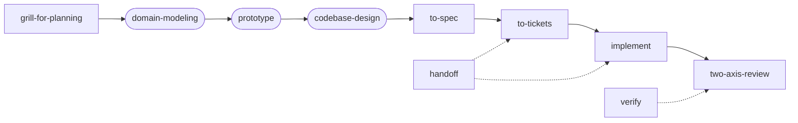

# skill-tree

My LLM agent skills, with the implementation behind each one (CLIs, tests, hooks), not just the
playbook. Portable across repos and machines, and across Claude Code and GitHub Copilot CLI —
both read the same `SKILL.md` spec.

## Workflow (idea → ship)

Many skills here chain into one engineering loop, adapted from Matt Pocock's
[AI Hero](https://www.aihero.dev/) skills. Each is human-invoked (`/skill-tree:<name>` in
Claude, `/<name>` in Copilot); `skill-tree help` prints the same map.



Rounded nodes are optional but usually worth it.

| Step | Skill | Output |
| --- | --- | --- |
| 1. Stress-test the idea | `grill-for-planning` | Shared understanding, decision tree |
| 2. (Optional) Pin down terms | `domain-modeling` | `CONTEXT.md` glossary, ADRs |
| 3. (Optional) Answer a design question | `prototype` | Throwaway HTML demo or variant route |
| 4. (Optional) Place the seams | `codebase-design` | Deep-module interfaces, test seams |
| 5. Write it down | `to-spec` | Spec (synthesis only, no interview) |
| 6. Slice it | `to-tickets` | Vertical-slice tickets with blocking edges |
| 7. Build | `implement` | TDD by default, verified proof it works, HITL by default |
| 8. Review | `two-axis-review` | Standards + Spec axes, in parallel |

Alongside: `handoff` (carry state across sessions), `verify` (back done-claims with
evidence). `domain-modeling` stays live after step 2 — revisit it whenever a term drifts.

## Installing

**Claude Code:**

```
/plugin marketplace add dannybrown37/skill-tree
/plugin install skill-tree@skill-tree
```

Every skill is then `skill-tree:<name>`. A `SessionStart` hook runs `scripts/install.sh`,
putting `skill-tree` and `handoff` on `PATH` (`~/.local/bin/`). Manual clone: run
`scripts/install.sh` yourself — it's idempotent and never overwrites files it didn't create.

**Copilot CLI:**

```bash
curl -fsSL https://raw.githubusercontent.com/dannybrown37/skill-tree/main/scripts/bootstrap.sh | bash -s -- --copilot
```

Details (bare names, generated hooks, auto-update): [docs/copilot.md](docs/copilot.md).

**Heads-up:** installing grants read access to images in your screenshots folder —
[docs/screenshot-permissions.md](docs/screenshot-permissions.md).

## Skills

Each lives at `skills/<name>/` with its own `SKILL.md`, `scripts/`, and `references/`.

<!-- skills:start -->
| Skill | What it does |
| --- | --- |
| `adversarial-review` | Manually-triggered red-team review of the current branch's diff. Constructs real failing inputs/races/states rather than checklist-verifying. |
| `bro` | Restate the last message in a more grokable way |
| `cli-ergonomics` | CLIs should be incredibly easy for humans to run. Invoke when creating a new CLI or subcommand a human will run (incl. a script promoted out of one-off use), or when the user asks for a CLI review. Not for edits to existing commands. Covers the argument-handling ladder (help over error, TTY-guarded prompts, fzf selection, echoing the replayable command) and the hard `--version` requirement. Not for pure-library or single-purpose CI-only scripts. |
| `codebase-design` | Shared vocabulary for designing deep modules. Invoke when designing or improving a module's interface, finding deepening opportunities, deciding where a seam goes, making code more testable, or when another skill needs the deep-module vocabulary — \"is this the right seam\", \"design this interface\", \"why does this feel shallow\". |
| `debug-ci` | Fix a GitHub Actions run that has failed — e.g. \"why did CI fail\", \"the build is red\", \"check the Actions run\", \"/debug-ci\". Fetches the failure logs via `gh`, diagnoses the root cause, and fixes it locally. User will review and push. |
| `debug-hooks` | Invoke to list or debug hooks — \"what hooks do I have\", \"is my hook firing\", \"why did that run twice\". Merges every hook source (settings, plugins, Copilot) into one list. |
| `domain-modeling` | Build and sharpen a project's domain model. Invoke when discussing codebase terminology, writing or editing a CONTEXT.md, or recording or editing an ADR — \"what do we mean by X\", \"define our terms\", \"write an ADR for this\". |
| `dynamodb-cost-audit` | Help a DynamoDB bill come down or a table needs an efficiency review. Ordered audit from biggest lever to smallest, with the thresholds that decide each call. Expensive so not invocable by agents. |
| `dynamodb-migrations` | Evolve a DynamoDB table that is already live: \"add a GSI\", \"backfill this attribute\", \"change the projection on an index\", \"migrate to a new key design\", \"how do I do this without downtime\", \"do we need to backfill or can we let it drift\". Ordered playbooks per evolution type, plus stream and backfill hazards. |
| `dynamodb-modeling` | Design a DynamoDB table or review one before it ships: \"what should my partition key be\", \"do I need a GSI here\", \"is this single-table design right\", \"review my access patterns\", or any new table/entity in a Dynamo-backed service. Access-pattern-first modeling, key strategies, index choice, and the anti-patterns that show up in review. |
| `grill-for-planning` | Stress-test a vague plan, decision, or idea before it's written down — \"grill me on this\", \"poke holes in this idea\", \"help me think this through\". Round-based interview that maps the idea into a decision tree and works it to a shared understanding. For prepping a specific artifact (RFC/PR/promo packet) against a review panel, use skill-tree:grill-for-quality instead. |
| `grill-for-quality` | Prep a specific artifact (design doc, PR/diff, promo packet, slides, or an entire codebase) for a real review panel, interview, or presentation — \"grill me on this RFC\", \"quiz me for promo\". Adaptive adversarial interview that pushes on real weak points. For stress-testing a vague plan or decision that isn't written down yet, use skill-tree:grill-for-planning instead. |
| `grill-for-visualization` | Turn an idea into a polished coded video (product showcase or system/concept explainer) — \"make an animation of how X works\", \"visualize this for a demo\", \"grill me for a visualization\". Round-based interview about what to show, a storyboard the user approves, then a React project that renders an MP4, with the source kept editable. For stress-testing a plan with no video at the end, use skill-tree:grill-for-planning instead. |
| `handoff` | A session needs to end or continue elsewhere — \"write a handoff\", \"I'm running low on context\", \"continue where we left off\". Writes and resumes a handoff that survives compaction. |
| `implement` | Implement a ticket or spec — \"build this\", \"implement the next ticket\", \"start working\". TDD by default at pre-agreed seams, typechecks regularly, and presents verified work for review. Human-in-the-loop by default; pass 'autonomous' to work the full frontier with guardrails. |
| `node-style` | Read before writing Node, TypeScript, or JavaScript code. Covers type safety, ESLint, error handling, testing (Jest/Vitest), and package management. |
| `prototype` | The user wants a throwaway prototype to answer a design question — \"sanity-check this state model\", \"try a few layouts for this page\", \"does this logic feel right\". Picks a shareable-HTML logic demo or a switchable-variant UI route based on the question, then makes sure the prototype survives as a primary source instead of rotting in main. |
| `python-style` | Read before writing Python code. Covers type hints, naming, error handling, tooling (uv, pytest, ruff), and testing conventions. |
| `repo-audit` | Sanity-check a repo against the owner's quality preferences — pre-commit hooks, type checking, linting, test coverage, CLI ergonomics, secrets hygiene, dependency pinning, CLAUDE.md freshness, default-branch protection, auto-merge. Reports what's missing or drifted, doesn't fix it. |
| `screenshot` | Invoke when the user refers to something on their screen — \"look at the screenshot\", \"see the screenshot I just took\", \"what does this dialog say\", \"look at my screen\" — whether or not they attached an image. |
| `site-launch` | Quality checks a website goes live, or for auditing one that already is — \"is this ready to ship\", \"why does my link look blank when I share it\", \"the site has no analytics\", \"add an RSS feed\". The checklist of things a site needs that aren't visible on the page itself. |
| `skill-audit` | Invoke when reviewing a repo's skills or references for structural drift — e.g. \"review my skills\", \"audit skills/references\", \"is this a skill or a reference\", \"are my skills bloated/stale\", or after adding/renaming a skill. Works against either the `.claude/skills/` (dotfiles-style) or top-level `skills/` (skill-tree-style) layout. |
| `to-spec` | A conversation has settled on what to build and it's time to turn it into a written spec — \"turn this into a spec\", \"write this up\", \"spec this out\". Synthesis only: no interview. Pairs well with skill-tree:grill-for-planning, which is where the settled understanding usually comes from. |
| `to-tickets` | Break a spec, plan, or conversation into tracer-bullet vertical-slice tickets with blocking edges — \"turn this into tickets\", \"break this down\", \"what's the work?\". Pairs with skill-tree:to-spec upstream and skill-tree:handoff downstream. |
| `tui-screenshots` | Use for generating or refreshing TUI screenshots for docs — \"regenerate the screenshots\", \"the README screenshots are stale\". Drives a Textual/TUI app headlessly and exports SVG. Not for reading a user's screenshot — that is `screenshot`. |
| `two-axis-review` | Two-axis review of changes since a fixed point (commit, tag, HEAD~N, or default HEAD~1): Standards (does the code follow this repo's conventions?) and Spec (does the code do what it should?). Axes run as parallel sub-agents so neither masks the other. Use when the user says \"review against the spec\", \"does this follow our conventions\", \"standards and spec review\", or \"two-axis review\". Not a correctness bug hunt — that's the built-in `/code-review`. |
| `ui-designer` | Design or restyle a web UI — landing pages, dashboards, docs sites, app chrome — or when the user asks why a site \"looks generic\", \"looks like a template\", or wants it to feel intentional. A running list of design lessons learned, applied as rules rather than suggestions. |
| `verify` | Verify before answering whether something works, is gone, is used, or is correct — and whenever the user says \"can you confirm\", \"are you sure\", \"did that actually work\", or reports something is \"still\" broken. Produces the answer plus the evidence that would have falsified it. |
| `wait-what` | Stop. Your plan/idea did not land. Re-pitch it. |
<!-- skills:end -->

## More

- [`skill-tree` CLI](docs/cli.md) — one shell entry point for every skill and script
- [Handoffs and the backlog](docs/handoff.md)
- [Dev mode](docs/dev-mode.md) — point the installed plugin at this checkout while authoring
- [Copilot CLI](docs/copilot.md)

## Testing

```bash
skill-tree test   # or: uv run pytest scripts/ skills/ -q
```

Pre-commit runs ruff, the test suite, and `scripts/check_skill_structure.py`.

## License

MIT — see [LICENSE](LICENSE).
