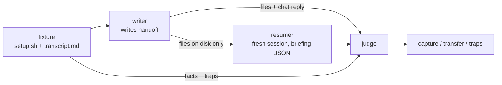

# handoff evals

A handoff only proves itself in the *next* session, and `claude plugin eval` grades a
single session. So `run.py` drives three headless `claude -p` calls per run:



## Arms

| arm | writer gets | resumer gets |
|---|---|---|
| `skill` | `SKILL.md` + CLI on PATH | SessionStart hook output + `SKILL.md` |
| `baseline` | the transcript only | nothing |
| `baseline-file` | transcript + "save it to a file" | nothing |

All sessions run with hooks, auto-memory, skills and session persistence off, in a temp
dir that is deleted afterward.

## Metrics

- **capture**: weighted share of fixture facts stated by the writer, in files or chat.
- **transfer**: weighted share of facts in the resumer's briefing. This is the one that matters.
- **traps**: things the resumer must not do or claim, such as proposing a dependency the user rejected.
- **hallucinations**, **anchor** (does the real HEAD sha appear), **status ok**
  (`**Status:**` matches the fixture's expected value), and **words**.

## Fixtures

| fixture | what it stresses |
|---|---|
| `01-mid-debug` | dead ends, a user-rejected dep, half-applied fix, blocked question |
| `02-reversed-decision` | user reverses an earlier decision; a fake SHA in the transcript |
| `03-multi-repo` | remaining work lives in a sibling repo |
| `04-near-empty` | nothing done; restraint, no invented progress |
| `05-awaiting-review` | done and green; next move is the user's |
| `06-second-handoff` | handoff #2 over #1; facts only in #1's narrative must survive |

Latest results and suggested `SKILL.md` changes: `FINDINGS.md`.

## Run

```bash
just eval handoff                                               # quick: skill arm, 1 run, Sonnet judge
just eval handoff --arm skill baseline baseline-file --runs 2   # the full comparison
just eval handoff --fixture 01-mid-debug                        # one fixture
```

`just eval handoff` passes `--arm skill --runs 1 --judge-model claude-sonnet-5-5 -j 6`
ahead of your flags, and a later flag overrides the default. Running `run.py` directly
(`uv run python evals/handoff/run.py`) uses its own defaults: every arm, 2 runs, and an
Opus judge.

Results go to `results/<timestamp>/` (gitignored): `summary.md`, `results.json`, and a
directory per run containing the handoff files, briefing, and judge verdict. Exits 1 if
any run did not complete. The scores are measurements and have no pass bar.
