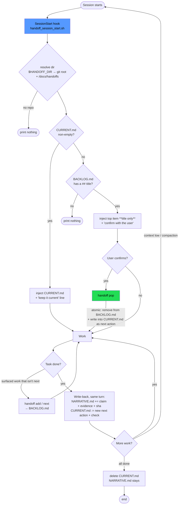
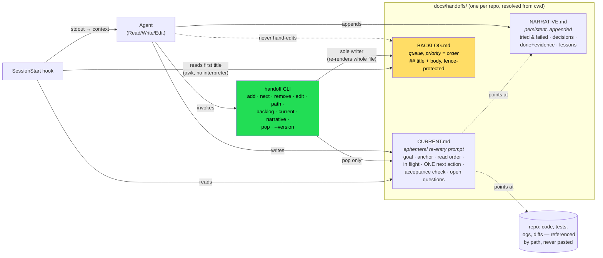

# How the pieces fit

Two diagrams: the lifecycle of a session under the hook, and who is allowed to write which
file. The rules they encode live in `SKILL.md` and `references/backlog.md` — this is the map.

## Session lifecycle

## The three files and who writes them

Invariants worth stating outright:

- `pop` is the only bridge from backlog to current, and it is never automatic.
- The hook reads; it never writes and never pops.
- `CURRENT.md` holds exactly one next action — everything else future-tense goes through
  `handoff add`.
